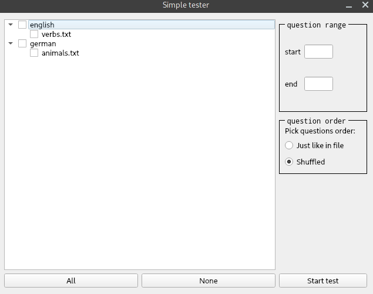
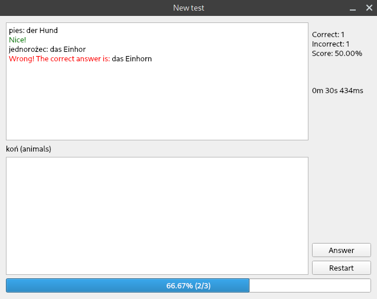

# Simple Tester

<!-- TODO(#11): Add description how the program works -->
With this program you can learn new vocabulary defined by yourself. Just put your text files in data directory.

It is neither a beautiful program nor has it readable code but it does the job for me.

| Main window                               | Quiz window                               |
| ----------------------------------------- | ----------------------------------------- |
|  |  |

## Quick start

```console
$ pip3 install -r requirements.txt
$ python3 main.py
```

### Your own data

Add your files to data directory.

Each file begins with line which is ignored (was used as category name)
If you want to change encoding the program tries to use, take a look at enc and ENC variables in <span>database.py</span>.

Example file content:

``` text
Category title which is not being used for now. You can write anything here.
jednorożec - das Einhorn
pies - der Hund
koń - das Pferd
```

## Contributing

I'm not looking for any contributions for now as it's just a simple project for fun.

## License

GPLv3

## TODO

- option to choose what language you want to translate to
